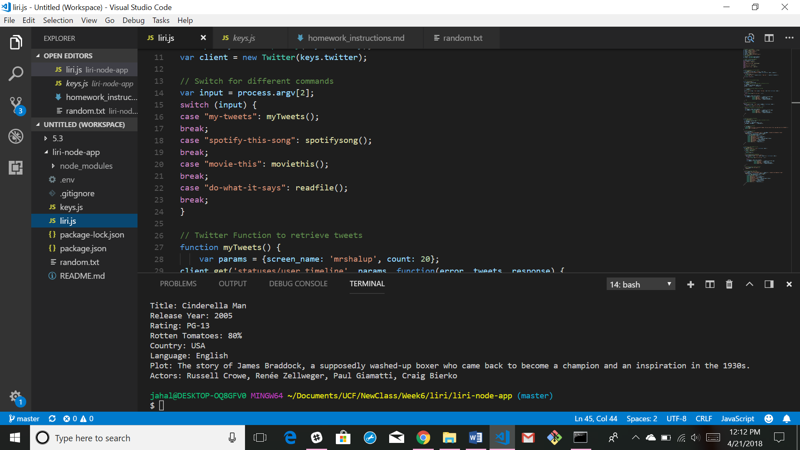

# liri-node-app
This project was created by Jaime Halupka as a requirement for homework during University of Central Florida's Coding
Bootcamp. 

**Instructions**
This application receives one of four different command options. 
"my-tweets": Prints out a copy of the 20 most recent tweets from the entered user
"spotify-this-song": Takes a song title and prints out information, including album, artist and a link to a short preview.
"movie-this": Takes a movie title and retrieves a list of info, including actors, plot summary, ratings, language and debut year.
"do-what-it-says": uses fs to read a text file and perform the appropriate command entered in that text file.